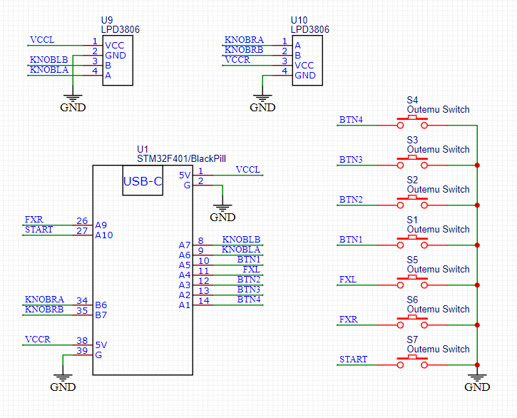

# DIY SDVX Controller

[Read this page in Russian (Читать на русском)](README_RU.md)

Hello! This is a DIY controller project for Sound Voltex and similar rhythm games. It's built using an STM32 microcontroller (Black Pill), with custom firmware, a custom PCB, and a 3D-printed enclosure.

## Project Features

*   **Microcontroller** STM32F401 (on a Black Pill v3.0 board).
*   **Buttons** 7 main (BT-A, B, C, D, START) + 2 FX buttons (FX-L, FX-R) on CherryMX switches (e.g., Outemu Red).
*   **Rotary encoders** 2 x LPD3806 (VOL-L, VOL-R).
*   **Addressable RGB lighting** on WS2812B LEDs (optional, strip connected to PB0).
*   **Interface** USB HID (the controller is recognized as a standard game device).
*   **Fully 3D-printed enclosure**.
*   **PCB** ideal for single-layer home etching, no need to order a board.

## Demonstration

## Hardware

All hardware-related files are located in the [`hardware/`](./hardware/) folder.

### PCB

The PCB project was designed in EasyEDA. Source files, Gerber files for ordering, and the BOM are located in `hardware/pcb/`.

| Schematic | Board Layout |
|---|---|
|  |  |

**PCB Assembly Photos:**

| PCB Front | PCB Back |
|---|---|
|  |  |

### Enclosure

3D models for the enclosure and its components were designed in KOMPAS-3D. Source CAD files, exported STEP files, and STL files for printing are located in `hardware/enclosure/` and `hardware/stl_for_printing/`.

3D models of the components used (BlackPill, encoders, switches) are in `hardware/enclosure/component_models_3d/`.

### Assembly Process (Photos)

| Connecting encoders to the front panel | LED strip installation |
|---|---|
|  |  |

**BlackPill Modification:**

Optionally, a small hardware modification can be made to the BlackPill by adding a 150nF ceramic capacitor (as shown in the illustration). This allows entering DFU mode by holding the START button for 10 seconds.

## Software (Firmware)

The firmware for the STM32 microcontroller was developed using STM32CubeIDE. The source code is located in the [`firmware/`](./firmware/) folder.

Key firmware functions:
*   Polling buttons and encoders states.
*   Controlling RGB lighting, including visual effects.
*   Transmitting data to the PC via USB HID protocol.

## Assembly and Setup

[A DETAILED ASSEMBLY GUIDE, COMPONENT LIST, FIRMWARE FLASHING INSTRUCTIONS, AND SETUP DETAILS WILL BE HERE]

General steps:
1.  **Print the enclosure parts** using the STL files from the `hardware/stl_for_printing/` folder.
2.  **Manufacture the PCB:** Either order it using the Gerber files from `hardware/pcb/gerbers/` or **etch it yourself** using the project files from `hardware/pcb/easyeda_project/`.
3.  **Assemble the PCB**, solder buttons, encoders, LED strips.
4.  **Assemble the enclosure.**
5.  **Flash the microcontroller** - compile the project from `firmware/` (or use a pre-compiled binary from the releases) and flash the Black Pill (e.g., via DFU mode or using an ST-Link).
6.  **You're awesome!**

More detailed instructions for assembly and setup will be added to the `docs/` folder later (sometime).

## License

This project is licensed under the **Creative Commons Attribution-NonCommercial-ShareAlike 4.0 International (CC BY-NC-SA 4.0)**.