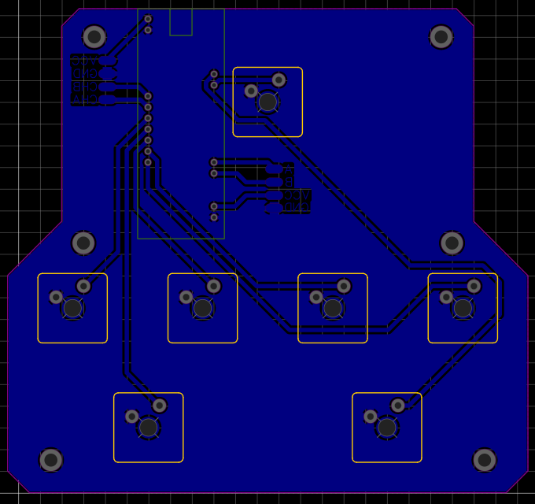

# DIY SDVX Controller

*Рендер собранного контроллера*

Привет! Это проект DIY контроллера для Sound Voltex и подобных ритм-игр. Он построен на базе микроконтроллера STM32 (Black Pill), с кастомной прошивкой, печатной платой и корпусом, напечатанным на 3D-принтере.

## Особенности проекта

*   **Микроконтроллер** STM32F401 (на плате Black Pill v3.0).
*   **Кнопки** 7 основных (BT-A, B, C, D, START) + 2 FX-кнопки (FX-L, FX-R) на CherryMX переключателях (например, Outemu Red).
*   **Энкодеры** 2 поворотных энкодера LPD3806 (VOL-L, VOL-R).
*   **Подсветка** Адресная RGB-подсветка на светодиодах WS2812B (опционально, лента на PB0).
*   **Интерфейс** USB HID (контроллер определяется как стандартное игровое устройство).
*   **Корпус** Полностью 3D-печатный.
*   **Печатная плата** Идеально для однослойного травления в домашних условиях, нет нужды заказывать плату.

## Демонстрация работы

*Демонстрация работы контроллера*

*Собранный контроллер (вид сверху на просвет)*

## Аппаратная часть

Все файлы, относящиеся к аппаратной части, находятся в папке [`hardware/`](./hardware/).

### Печатная плата
Проект печатной платы разработан в EasyEDA. Исходные файлы, Gerber-файлы для заказа и спецификация (BOM) находятся в `hardware/pcb/`.

*Электрическая принципиальная схема*

*Дизайн печатной платы (скриншот из САПР)*

**Фотографии сборки PCB:**
| Лицевая сторона PCB | Оборотная сторона PCB |
|---|---|
|  |  |

### Корпус
3D-модели корпуса и его компонентов разработаны в КОМПАС-3D. Исходные файлы CAD, экспортированные STEP-файлы и STL-файлы для печати находятся в `hardware/enclosure/` и `hardware/stl_for_printing/`.

3D-модели используемых компонентов (BlackPill, энкодеры, переключатели) находятся в `hardware/enclosure/component_models_3d/`.

### Процесс сборки (фото)

| Подключение энкодеров к передней панели | Установка светодиодной ленты |
|---|---|
|  |  |

**Доработка BlackPill:**

При желании можно выполнить одну небольшую аппаратную модификацию для BlackPill, добавив керамический конденсатор на 100 нФ (как на иллюстрации), чтобы можно было уходить в DFU по зажатию START на 10 секунд. 

## Программное обеспечение (Прошивка)

Прошивка для микроконтроллера STM32 разработана с использованием STM32CubeIDE. Исходный код находится в папке [`firmware/`](./firmware/).

Ключевые функции прошивки:
*   Опрос состояния кнопок и энкодеров.
*   Управление RGB-подсветкой, включая визуальные эффекты.
*   Передача данных на ПК по USB HID протоколу.

## Сборка и настройка

[ЗДЕСЬ БУДЕТ ПОДРОБНОЕ РУКОВОДСТВО ПО СБОРКЕ, СПИСОК КОМПОНЕНТОВ, ИНСТРУКЦИИ ПО ПРОШИВКЕ МК И НАСТРОЙКЕ]

Примерный порядок действий:
1.  **Печать деталей корпуса** Используйте STL-файлы из папки `hardware/stl_for_printing/`.
2.  **Изготовление PCB** Закажите плату по Gerber-файлам из `hardware/pcb/gerbers/` или вытравите самостоятельно по проекту из `hardware/pcb/easyeda_project/`.
3.  **Закупка компонентов** См. `hardware/pcb/bom/BOM_...csv`.
4.  **Сборка электроники** Пайка компонентов на плату, подключение кнопок, энкодеров, светодиодов.
5.  **Сборка корпуса.**
6.  **Прошивка микроконтроллера** Скомпилируйте проект из `firmware/` и прошейте Black Pill (например, через DFU режим или с помощью ST-Link).
7.  **Подключение и игра!**

Более подробные инструкции по сборке и настройке будут добавлены в папку `docs/` позже.

## Лицензия

Этот проект распространяется под лицензией **Creative Commons Attribution-NonCommercial-ShareAlike 4.0 International (CC BY-NC-SA 4.0)**.